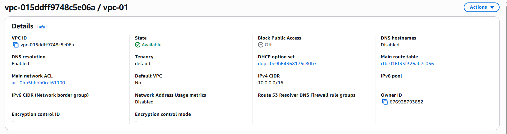
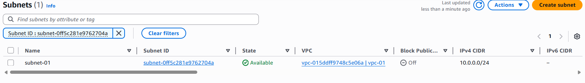
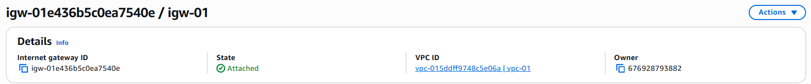
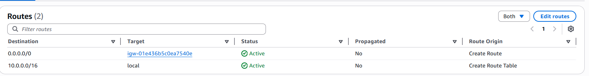
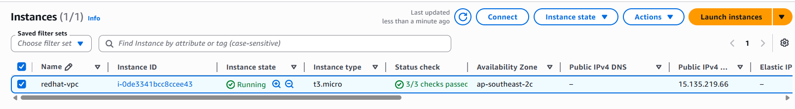
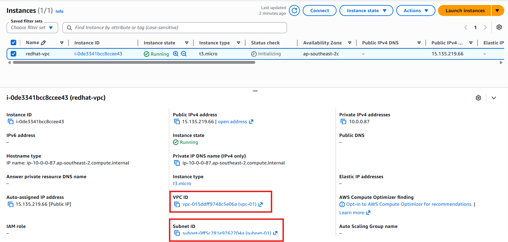

# AWS VPC Configuration Project

## Objective

Create and configure a custom Virtual Private Cloud (VPC) in AWS.

---

## Services Used

- AWS VPC
- Subnet
- Internet Gateway
- Route Table
- Ec2 instance

---

## Step 1 - Create VPC

Create a custom VPC from AWS Console.

---

## Step 2 - Create Public Subnet

Create a public subnet inside the VPC.

---

## Step 3 - Create Internet Gateway

Create and attach Internet Gateway to VPC.

---

## Step 4 - Configure Route Table

Add route to Internet Gateway.

---

## Step 5 - Create EC2 Instance

Launch an EC2 instance inside the configured VPC.

---

## Step 6 - Verify VPC Configuration

Verify that the EC2 instance is running inside the custom VPC and subnet.

---

# Final Result

Successfully created and configured a custom AWS VPC with public subnet, Internet Gateway, Route Table and EC2 instance.
